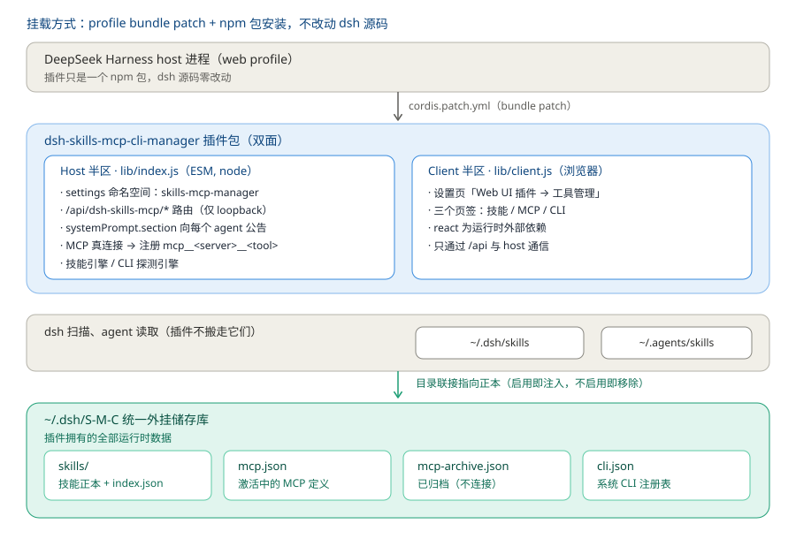
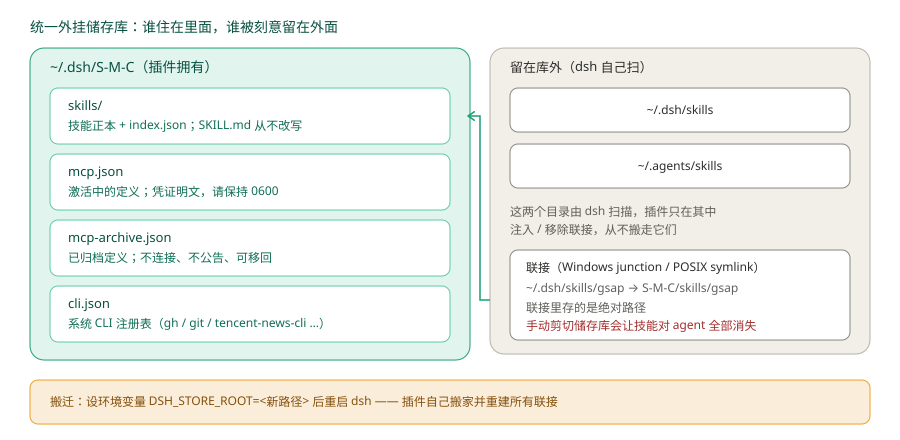
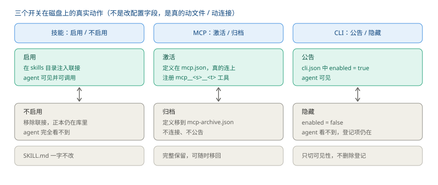

<div align="center">
  🌏 <b>中文</b> · <a href="./README.md">English</a>
</div>

<div align="center">
  <b style="font-size: 1.15em;">一个 DeepSeek Harness (DSH) Web 插件：在同一个设置页里管理「技能 + MCP + CLI」三类 agent 工具，并附一个使用说明页。</b><br /><br />
  <a href="https://github.com/YpipaQ/dsh-s-m-c-center/releases"></a>
  <a href="https://github.com/YpipaQ/dsh-s-m-c-center/stargazers"></a>
  <a href="https://github.com/YpipaQ/dsh-s-m-c-center/forks"></a>
  <a href="https://www.npmjs.com/package/dsh-s-m-c-center"></a>
  <a href="https://www.npmjs.com/package/dsh-s-m-c-center"></a>
  <a href="./LICENSE"></a>
  <a href="./package.json"></a>
  <a href="./package.json"></a>
</div>

# 三合一工具台 · dsh-s-m-c-center

> 中文名：**三合一工具台** ｜ 界面入口：「Web UI 插件 → 工具管理」 ｜ 别名：工具管理、工具中心、技能管理、MCP 服务器管理、CLI 工具管理、Skills / MCP / CLI 管理器

> **工具管理** —— 一个自包含的 DSH Web 插件，在设置页新增一个一级页面，统一管理 agent 的**三类工具**：**技能（Skills）/ MCP 服务器 / 本地 CLI 工具**；另有一个使用说明页，讲清三者各自的工作方式，并在最下方负责把它们干净地还回去。
>
> 仅通过 profile bundle patch + 包安装挂载 —— **不改任何 DeepSeek Harness 源码**。

## ✨ 它是什么

一个设置页（「Web UI 插件 → **工具管理**」）管理 agent 的三类工具，外加一个使用说明页 —— 它既是说明书，也是卸载前的总撤退口：

| 页签 | 管理 | 底层 |
|---|---|---|
| **Skills 技能** | 浏览 / 启用 / 不启用 / 删除 / 导入技能（项目级 + 用户级） | 用户级走 `~/.dsh/S-M-C/skills` 正本 + 目录联接；项目级改写 `SKILL.md` 前言 |
| **MCP 服务** | 新建 / 编辑 / 测试 / 激活 / 归档 / 删除 MCP 服务器 | 真实 `@deepseek-ai/dsh-mcp-client` 连接（`mcp__<server>__<tool>`）；归档移入 `S-M-C/mcp-archive.json` |
| **CLI 工具** | 发现 / 探测本地 CLI 工具；登记系统 CLI | skill 内嵌 `scripts/run-cli` + `S-M-C/cli.json` |
| **使用说明** | 三类工具各自的工作方式（储存库与联接、真实连接与归档、CLI 发现与公告），以及卸载前的准备 | 说明集中在此页，前三个页签保持纯操作；卸载准备在最下方 |

> 完整说明见 [`docs/功能介绍.md`](./docs/功能介绍.md)。

## 💡 功能

- **技能**：按项目级 / 用户级与来源分组（`.dsh/skills`、`.agents/skills`、`~/.dsh/skills`、`~/.agents/skills`）。用户级技能迁入**统一储存库** `~/.dsh/S-M-C/skills`，启用 = 在 skills 目录注入目录联接，不启用 = 移除联接（`SKILL.md` 一字不改）；项目级技能就地管理，仍用前言开关。删除是两步确认、物理删除；点开可看详情（description / whenToUse / 正文）；支持从任意目录扫描导入（原生目录选择器或手写路径），导入即入储存库并启用。
- **MCP**：分「管理 / 新建」两个子页——管理页一台服务器一个 **激活 / 归档** 开关（外加删除），新建页提供表单或 JSON 编辑，保存前可**测试连接**（一次性真实探测）；**激活 / 归档**真实连接 / 断开并注册 `mcp__<server>__<tool>` 工具（归档的定义移到 `S-M-C/mcp-archive.json`，不连接、不公告，但完整保留可随时移回）；实时状态（连接中 / 运行中 / 失败 / 已停止）。
- **CLI**：自动发现 skill 包装的 CLI（`scripts/run-cli.*` / `cli-state.*`，即 tencent-news 模式），并登记系统 CLI（`gh`、`git`、`tencent-news-cli` …，存于 `S-M-C/cli.json`）。每条都会探测：是否安装 / 版本 / 是否需更新 / API-Key 状态（解析 `cli-state` JSON）/ 子命令（解析 `help`），并在行上标出来源与位置（`技能 CLI · <路径>` / `系统 CLI · <路径>`）。**公告 / 隐藏**开关只决定是否把这个 CLI 写进给 AI 的公告 —— 插件无法启停系统装的 CLI，因此**默认隐藏**；随 skill 安装的（标「技能 CLI」）更建议保持隐藏，它们主要供所属 skill 自己调用。
- **使用说明**：按技能 / MCP / CLI 三类讲清各自的工作方式，最下方是卸载前的总撤退口。「撤销迁移」（红）把储存库技能移回原始位置；储存库空着而 skills 目录还有技能时，同一按钮自动变为绿色的「迁移」，随时把技能再收进储存库——**双向可逆**；「MCP 全部注入」把归档服务器一次性移回 `mcp.json` 并重新连接；页面同时明确列出卸载后需手动删除的储存库目录与配置块。
- **界面**：全量文案 zh / en 双语（各 191 键，英文环境零中文）；「向 AI 公告」的长说明折叠进标题行，默认收起、点击展开；删除等破坏性操作为两步确认。

## 📷 界面预览

<div align="center">
  
  
  <br />
  
  
</div>
<p align="center"><i>四个页签：技能（统一储存库 + 联接）、MCP（真实连接）、CLI（发现 / 探测 / 登记）、使用说明（工作方式说明 + 双向可逆的迁移与手动清理清单）。个人路径已打码。</i></p>

## 🏗️ 架构

**挂载与双面结构** —— 插件只是一个 npm 包 + 一行 profile bundle patch，dsh 源码零改动：

<div align="center">
  
</div>
<p align="center"><i>Host 半区注册路由、公告 agent、真连 MCP；Client 半区只提供设置页，两者通过 <code>/api/dsh-s-m-c-center/*</code> 通信。</i></p>

**储存库布局** —— 插件的数据全部收在 `~/.dsh/S-M-C`，而 dsh 扫描的两个目录刻意留在库外（插件只往里面注入 / 移除联接）：

<div align="center">
  
</div>
<p align="center"><i>技能的「正本」始终在储存库里；<code>~/.dsh/skills</code> 下那个条目只是指向正本的联接。</i></p>

**三个开关在磁盘上的真实动作** —— 不是改配置字段，是真的动文件 / 动连接：

<div align="center">
  
</div>
<p align="center"><i>技能 = 增删联接；MCP 激活 / 归档 = 定义在 <code>mcp.json</code> 与 <code>mcp-archive.json</code> 之间搬家；CLI = 只切可见性。</i></p>

## 🚀 安装

> **环境要求**：DeepSeek Harness **`>= 0.1.2-alpha.2`**（`@deepseek-ai/*` 全部统一发版）。
> 现状：**`0.1.6-alpha.1`（当前版本）与 `0.1.5-rc.2` 上完整实测**；
> `0.1.2-alpha.2` 起所用 API 已逐一核对存在且签名一致。

> **必须按普通包安装 —— 切勿 junction 链接。** junction 会让依赖（`schemastery` / `react` 等）无法向上解析，并导致包名与 `cordis.patch.yml` 不一致；两者都会让 DSH 启动失败。

> **npm 发布说明**：本包（`dsh-s-m-c-center`）**尚未发布到 npm** —— 因作者个人原因，发布顺延至 9 月 17 日之后。
> 在此之前，请使用下方的源码或打包产物方式安装。

```sh
# 从 npm 安装（9/17 之后可用）：https://www.npmjs.com/package/dsh-s-m-c-center
dsh plugin --profile web add dsh-s-m-c-center
# 或：npm install dsh-s-m-c-center

# 从源码（本仓库 / 克隆后）
dsh plugin --profile web add <本文件夹绝对路径>

# 或安装打包产物
dsh plugin --profile web add <path>/dsh-s-m-c-center-<version>.tgz

# 或使用一键脚本
bash scripts/install.sh                                        # macOS / Linux / Git Bash
powershell -ExecutionPolicy Bypass -File scripts/install.ps1   # Windows
```

首次安装后需要**重启 DSH 并硬刷新浏览器**（Cmd/Ctrl+Shift+R），然后进入「设置 → Web UI 插件 → **工具管理**」。

> **更新无需重启**：装好之后，后续升级这个插件**理论上不需要重启 DSH** —— 覆盖文件后直接硬刷新浏览器即可。
> （只有改动涉及 Host 侧路由或后端逻辑时才需要重启一次 DSH 进程；纯界面上的改动刷新即生效。）

## ⚙️ 配置

```yaml
# 本插件自己的设置命名空间（dsh settings）
dsh-s-m-c-center:
  enabled: true        # 总开关（路由、MCP 连接、CLI 探测）
  announceToAgent: true # 向每个 agent 的系统提示说明本插件
```

运行时状态：

- **统一外挂储存库**：本插件的数据全部收在 `~/.dsh/S-M-C/`（**S**kills / **M**CP / **C**LI）—— `skills/`、`mcp.json`、`mcp-archive.json`、`cli.json`。旧位置在首次启动时自动迁入；整个库可用 `DSH_STORE_ROOT` 挪到别处（插件会自动重建目录联接）。
- MCP：激活的 `S-M-C/mcp.json`，归档的 `S-M-C/mcp-archive.json`（凭证 / headers 明文保存 —— 请保持这两个文件 `0600`）。
- CLI 注册表：`S-M-C/cli.json`。

## 🔒 权限与依赖声明

插件以 DSH 进程权限运行，会用到文件、网络、命令与凭据四类能力 —— 逐项说明用途与边界：

| 能力 | 做什么 | 范围与边界 |
|---|---|---|
| **文件** | 读写储存库 `~/.dsh/S-M-C/**`（`skills/`、`mcp.json`、`mcp-archive.json`、`cli.json`）；在技能根目录创建 / 移除目录联接；读取 `SKILL.md` 与 skill 内嵌脚本 | 只动储存库与 dsh 扫描的四个技能根目录（项目 / 用户级的 `.dsh/skills`、`.agents/skills`）；就地技能只改写前言标记；不读写其它路径 |
| **网络** | 连接用户自己配置的 MCP 服务器（stdio 走子进程，streamable-http 走 HTTP） | 只连用户在管理页填写的服务器地址；插件自身**无**内置外部服务、**无**遥测、不上报任何数据 |
| **命令** | 探测本地 CLI 工具：执行其 `--help` / `--version` 或 `cli-state` 声明的探测命令，以报告是否安装、版本、子命令 | 只执行注册表内、管理页可见的命令；不执行用户未登记的其它命令 |
| **凭据** | 保存 MCP 的 env / headers / API-Key，读取 CLI 的 `cli-state` | 只在本机 `~/.dsh/S-M-C/*.json` 明文读写、不外发；建议将这两个文件权限设为 `0600` |

**外部依赖**：运行时依赖仅 `schemastery`（设置项校验）；`@deepseek-ai/*` 与 `react` 是 peer 依赖，由 DSH 提供；无原生模块，**无** postinstall / prepare 等生命周期脚本。

**失败边界**：目录扫描或路由失败降级为空列表与占位提示；迁移失败只记入 `failures` 并继续，不阻塞 DSH 启动；MCP 连接失败只改变状态显示、不动文件；公告渲染失败回退到静态文案。任何一项都不会让 DSH 启动失败。

**已知风险**：技能删除是物理删除、不可恢复；MCP 凭证明文保存；技能启用 / 禁用经目录联接生效，手动剪切储存库会让联接失效（需要时用 `DSH_STORE_ROOT` 搬迁，插件会自建联接）。

## 🗂️ 仓库结构

```
dsh-s-m-c-center/
├── src/                # TypeScript 源码（宿主 + 客户端两半区）
│   ├── index.ts        # 宿主入口（插件加载、设置命名空间、agent 公告）
│   ├── skills.ts       # 技能文件系统引擎
│   ├── mcp.ts          # MCP 配置存储 + 真连接管理器
│   ├── cli.ts          # CLI 发现 / 探测 / 注册表 + cli-state 解析
│   ├── routes.ts       # /api/dsh-s-m-c-center 路由族
│   ├── protocol.ts     # 共享类型 + API 路径
│   └── client/         # 浏览器半区（入口、SettingsCard、manager、api、locales、css）
├── lib/                # 构建产物（宿主：index.js；客户端：client.js；types/*）
├── cordis.patch.yml    # DSH bundle patch（包名必须与 package.json 一致）
├── dsh.plugin.json     # DSH 插件清单（id / version / main / client.main）
├── package.json        # npm 包（dsh.bundle.patch + dsh.client）
├── LICENSE             # MIT
├── README.md / README.zh.md
├── docs/
│   ├── 功能介绍.md      # 完整功能说明
│   ├── development.md  # 开发说明（构建、测试、储存库布局）
│   ├── arch-*.svg      # 架构图（本文档引用）
│   ├── social-preview.png  # 仓库社交预览图（在仓库设置里上传）
│   └── shots/          # 界面截图（本文档引用）
└── scripts/install.*   # 一键安装进 DSH profile
```

## 🛠️ 开发

见 [`docs/development.md`](./docs/development.md)：双半区构建（`tsdown` 重建 `lib/index.js` + `lib/client.js`）、类型检查与测试套件。

## 📄 许可

[MIT](./LICENSE)。

---

*English: [`README.md`](./README.md).*
